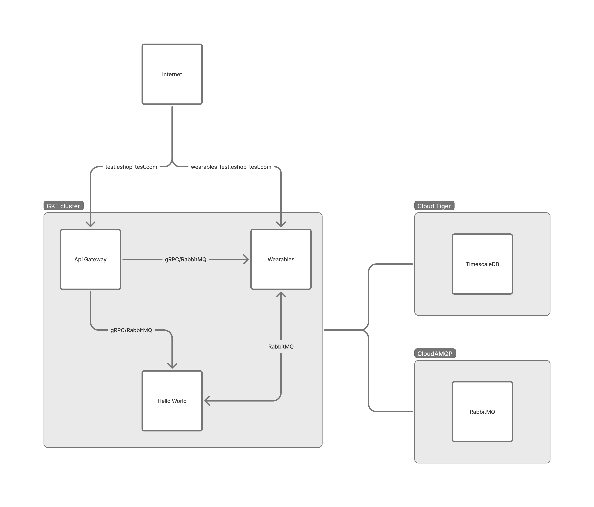

# MyEshop — Microservices from Scratch

A pet project where I researched how to build a microservices platform from absolute scratch. I wanted to understand every layer — from Kubernetes deployment and async messaging to gRPC communication, background task processing, and CI/CD pipelines. The goal was never to ship a product, but to learn how distributed systems actually work by building one piece at a time.

The platform runs on GKE (Google Kubernetes Engine) with three Python microservices, a shared library, and production-grade infrastructure.

---

## Architecture

<p align="center">
  
</p>

Services communicate via **gRPC** (sync) and **RabbitMQ** (async). Databases and message broker are hosted externally as managed services.

## Services

| Service | Protocols | What it does |
|---------|-----------|--------------|
| **API Gateway** | HTTP | Public-facing entry point. Routes requests, publishes events to RabbitMQ, calls Hello World over gRPC |
| **Hello World** | gRPC, RabbitMQ consumer | Internal service. Exposes gRPC procedures, consumes events and async commands |
| **Wearables** | HTTP, RabbitMQ consumer, TaskIQ worker | Ingests webhook data from a wearable health platform, stores time-series data in TimescaleDB, runs scheduled background jobs |

## Code Organization

Every service follows **vertical slice architecture** — code is organized by domain context, not by technical layer. The first-level split inside each service is by **communication protocol**: `http/`, `grpc/`, `messaging/`, `background_tasks/`. Shared domain code — models, repositories, schemas, settings — lives at the service root and is accessible from all protocol folders.

Not every service needs every protocol. API Gateway only has `http/` and a messaging publisher. Hello World has `grpc/` and `messaging/`. Wearables has all four.

The Kubernetes manifest structure mirrors the code: `deploy/k8s/services/wearables/base/http/`, `base/messaging/`, `base/background-tasks/`. All process types share one Docker image — the Dockerfile has no `CMD`, and each Kubernetes deployment specifies its own command.

---

## Communication

### Synchronous — gRPC

For synchronous inter-service communication we use gRPC. Proto definitions live in a shared package (`grpc_protos`) so both client and server stay in sync.

### Asynchronous — RabbitMQ

Before building the messaging layer, I spent time researching how to design queues for async communication between microservices. The central question was: **how should queues map to services and events?**

#### Queue-per-Service, Not Queue-per-Event

The first idea that comes to mind is to create a queue per event type — one queue for `Event1`, another for `Event2`. The fundamental problem with that design is **ordering**. If two events happen almost simultaneously but live in separate queues with separate consumer groups, there is no way to guarantee they will be processed in the order they were produced.

The alternative is **queue-per-service** — each consuming service gets one queue, and all events it cares about flow into that single queue. This way, if ordering between events matters within one service, you can reason about it because everything arrives through one channel. This is the approach we use here, and it aligns naturally with DDD bounded contexts: if two services need ordering guarantees between them, your bounded context boundaries are probably wrong.

What if ordering matters across two services? The answer comes from DDD: if two services need ordering guarantees between them on the broker level, the bounded context boundaries are probably wrong. Redesign the boundaries rather than coupling services through shared queues.

#### Exchange-per-Event

We follow an **exchange-per-event** pattern. Every message type gets its own fanout exchange, and service queues bind to the exchanges they care about. A single queue can receive multiple message types — handlers use a `message_type_filter` that inspects the message body to route to the correct handler function.

There are two kinds of messages: **Events** and **Async Commands**. Events are for multiple consumers — the same event is delivered to every service that subscribes. Async Commands target a single consumer.

#### Acknowledgement Mode

Both messaging consumers and background tasks use **ACK-always** semantics. A message should only remain unacknowledged if the worker itself is dead — in all other cases, the message is acknowledged regardless of whether the handler succeeds or fails. We define explicitly how to handle exceptions: either through delayed retries or by routing straight to a dead-letter queue. This gives us full control over error handling instead of relying on broker redelivery.

#### Message Contracts and Schema Compatibility

Message definitions live in their own package (`messaging_contracts`) with zero dependencies on services or the shared library.

Every message class has a numeric `code` (e.g., `HelloWorldEvent.code = 1`) that serves as a stable identifier. Exchange names are derived from these codes (`msg-1`, `msg-2`).

Schemas use Pydantic with `extra="allow"`, which gives us **backward and forward compatibility**. If a new version of a service adds a field to an event, old consumers simply ignore the unknown field. If an old publisher sends a message without the new field, new consumers handle the absence. This means services can be deployed in any order — there's no coordination required.

#### Topology as Code

The RabbitMQ topology — exchanges, queues, bindings, dead-letter queues, delayed-retry queues — is declared in a separate package (`rabbitmq_topology`) and applied as a Kubernetes Job before any service starts. The core idea is that both publishers and subscribers are kept deliberately simple: a publisher only knows which exchange to send to, a subscriber only knows the name of the queue to consume from. Neither side knows how messages are routed from one to the other. That routing logic — which exchanges bind to which queues — is controlled entirely through the topology package, in one place. This also keeps the broker's shape visible and prevents drift.

#### At-Least-Once Delivery and Idempotency

We have at-least-once delivery semantics. RabbitMQ may deliver the same message more than once, so every consumer tracks processed messages in a local `ProcessedMessage` table with a unique constraint on `(logical_id, message_code)`. If the same message arrives twice, the database rejects the duplicate with an `IntegrityError`, which is caught and converted to a `DuplicateMessageError`. The message is acknowledged and skipped — no reprocessing, no side effects.

The idempotency record is saved *before* executing business logic, within the same database transaction.

#### Retries and Dead-Letter Queues

When a handler fails with a transient error, it doesn't just retry immediately. Instead, the retry decorator publishes the message to a `.delayed-retry` queue with a TTL. When the TTL expires, RabbitMQ's dead-letter exchange routes the message back to the original queue. This gives the downstream system time to recover. After exhausting retries, the message lands in a `.dlq` (dead-letter queue) with a 7-day TTL for manual inspection.

---

## Background Tasks — TaskIQ

The Wearables service runs a TaskIQ worker backed by RabbitMQ for background job processing. Tasks follow the same idempotency pattern as message consumers — each task message has a `logical_id` and `code`, tracked in a `ProcessedTaskMessage` table. Tasks also use ACK-always semantics — failed tasks are retried explicitly, not redelivered by the broker.

Background task schemas use `extra="allow"` for backward compatibility, but unlike messaging schemas, they don't need forward compatibility. The reason is deployment order: background task workers always deploy before the publishers that dispatch tasks. So a new task field is always understood by the worker before any publisher starts sending it.

---

## Data Layer

### Database per Service

Each service owns its database — Wearables has its own TimescaleDB instance, Hello World has its own PostgreSQL. Connection pooling goes through PgBouncer to limit connection count in the cluster.

Wearables uses TimescaleDB hypertables for time-series wearable data with automatic compression and chunking.

### Zero-Downtime Migrations

Database migrations use Alembic with an **expand/contract** branching strategy. The CI/CD pipeline runs them in two phases:

1. **Expand** — runs *before* deploying new code. Adds new columns, tables, or indexes. The old code keeps working because it simply ignores the new columns.
2. **Contract** — runs *after* all pods are on the new version. Drops old columns or renames things. Safe because no running code references the old schema anymore.

This enables zero-downtime deployments — at no point is running code incompatible with the database schema.

---

## Shared Library

The `libs` package contains reusable code shared across services: FastAPI middleware (request body limits, security headers, request ID propagation, exception handling, logging), FastStream utilities (message filtering, retry decorators, idempotency models), TaskIQ extensions (health server, retry middleware), SQLModel base model with automatic `created_at`/`updated_at`, Alembic helpers for TimescaleDB operations, and settings mixins.

Services compose their settings from mixins — API Gateway uses `SentrySettingsMixin` and `FaststreamSettingsMixin` (no database), while Wearables adds `PostgresSettingsMixin` and `TaskiqSettingsMixin`. Each mixin contributes its fields, and services declare only what they need.

Locally, settings load from a `env.dev.yaml` file. In production, the file doesn't exist — Kubernetes injects everything through ConfigMaps and Secrets. The settings loader checks if the file exists and skips it gracefully.

---

## Cross-Cutting Concerns

### Request Tracing

Every request gets an `X-Request-ID` that follows it across HTTP calls, gRPC procedures, RabbitMQ messages, and TaskIQ tasks. The ID is stored in a Python `ContextVar` and propagated through middleware at each protocol boundary. Every log line includes the request ID, so you can trace a single user request through the entire system.

### Import Boundaries

Module boundaries are enforced by `import-linter` and checked in CI. The rules are:

- `messaging_contracts` has zero external dependencies — it knows nothing about services, libs, or topology
- `rabbitmq_topology` depends only on `messaging_contracts`
- `grpc_protos` is fully isolated
- `libs` cannot import from any service
- Services cannot import from each other

This means you can refactor a service without worrying about breaking another.

---

## Infrastructure

### Kubernetes

The cluster runs on GKE with two node pools — a default pool for most services and a dedicated pool for Wearables (isolated because webhook ingestion is bursty and shouldn't starve other services). Node pool sizes and replica counts are configured to survive the loss of a single node — there are always enough resources to reschedule pods if one node goes down.

### TLS

Automated through cert-manager with a wildcard certificate (`*.eshop-test.com`) issued by Let's Encrypt via Cloudflare DNS-01 challenge.

### Secrets

Stored in GCP Secret Manager and synced into Kubernetes by External Secrets Operator. Services never reference GCP directly — they consume standard Kubernetes Secrets.

### Autoscaling

Works differently per workload type. HTTP and gRPC deployments use standard HPA (Horizontal Pod Autoscaler) based on CPU. Background task and messaging workers use KEDA, which scales based on RabbitMQ queue depth — if messages pile up, more workers spin up automatically.

### Monitoring

Google Managed Prometheus with PodMonitoring resources.

All services implement graceful shutdown to ensure zero dropped requests during rolling updates.

### CI/CD

**On pull request**: linting (Ruff), formatting, import boundary checks, tests with 90%+ coverage requirement, version bump validation (changed code must bump the package version), K8s manifest validation, and proto generation drift detection.

**On deployment** (push to `test/**` branches): a dependency-ordered pipeline that publishes shared packages first (`messaging_contracts` → `grpc_protos` → `rabbitmq_topology` → `libs`), then deploys infrastructure (PgBouncer, KEDA trigger auth, cert-manager), applies RabbitMQ topology as a Job, and finally deploys each service through: expand migration → deploy workers/consumers → deploy HTTP/gRPC → contract migration.

---

## Tech Stack

**Language:** Python 3.14, fully async

**Frameworks:** FastAPI, gRPC (grpcio), FastStream, TaskIQ, SQLModel, Alembic, Pydantic

**Infrastructure:** GKE, NGINX Ingress, cert-manager, KEDA, External Secrets Operator, PgBouncer, TimescaleDB (Cloud Tiger), RabbitMQ (CloudAMQP)

**Tooling:** Poetry (monorepo workspace), Ruff, import-linter, pytest, GitHub Actions, Kustomize, Docker

## Local Development

```bash
# Start local infrastructure (TimescaleDB + RabbitMQ)
just up-infra

# Install dependencies
poetry install

# Run linting and tests
poetry run ruff check --fix .
poetry run ruff format .
poetry run lint-imports
poetry run pytest --cov --cov-fail-under=90
```

## Project Structure

```
src/
├── messaging_contracts/        # Message definitions (Event, AsyncCommand)
├── rabbitmq_topology/          # Exchanges, queues, bindings, DLQs
├── grpc_protos/                # Proto files and generated stubs
├── libs/                       # Shared library
│   ├── fastapi_ext/            #   Middleware, schemas
│   ├── faststream_ext/         #   Message utils, retry, idempotency
│   ├── taskiq_ext/             #   Task messages, health server
│   ├── sqlmodel_ext/           #   Base model, async session
│   ├── alembic_ext/            #   Migration helpers, TimescaleDB ops
│   └── ...                     #   Logging, Sentry, Prometheus, settings
└── services/
    ├── api_gateway/
    │   ├── http/               #   FastAPI app, routes, schemas
    │   └── messaging/          #   RabbitMQ publisher
    ├── hello_world/
    │   ├── grpc/               #   gRPC server and procedures
    │   └── messaging/          #   Consumer handlers
    └── wearables/
        ├── http/               #   Webhook ingestion API
        ├── messaging/          #   Consumer handlers
        ├── background_tasks/   #   TaskIQ worker and scheduler
        ├── models.py           #   WearableEvent (hypertable)
        └── migrations/         #   Alembic (expand/contract)

deploy/k8s/
├── infrastructure/             # cert-manager, NGINX, KEDA, PgBouncer, secrets
├── services/                   # Per-service: base + environment overlays
└── bases/                      # Shared templates (migration job)
```
